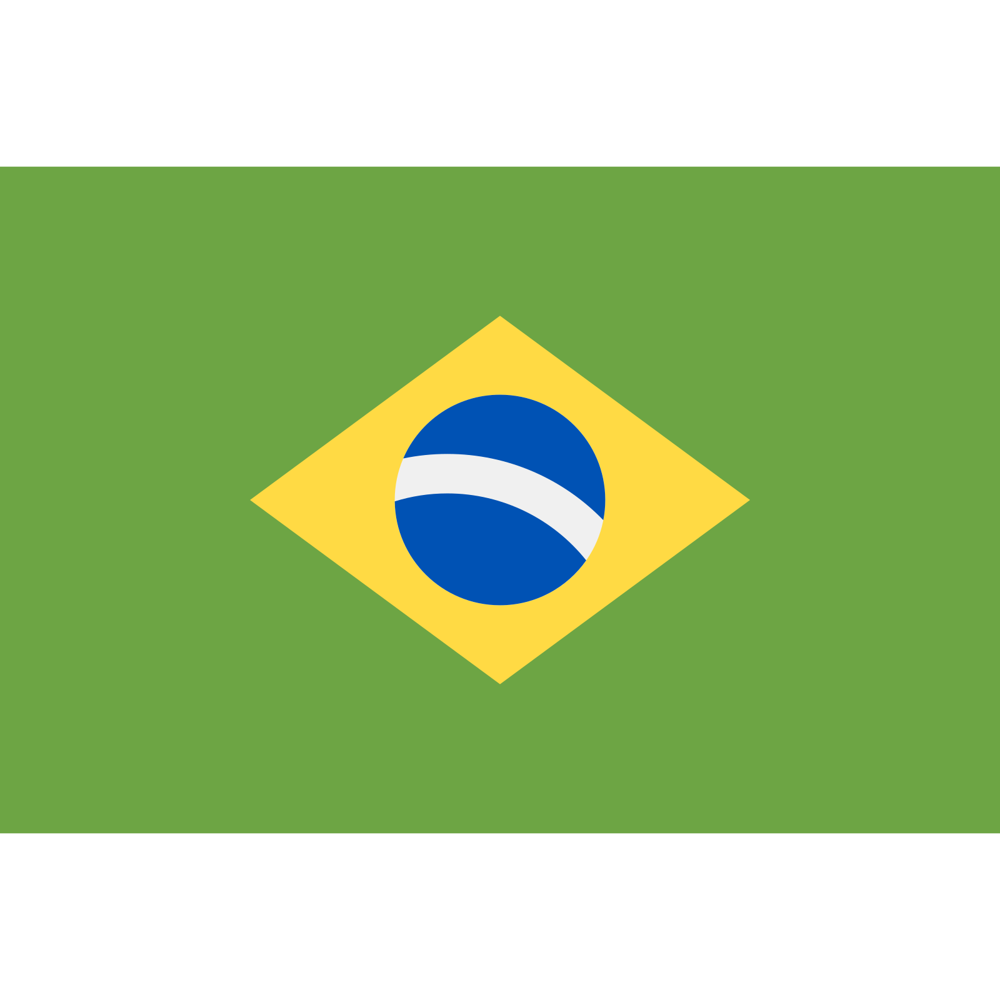
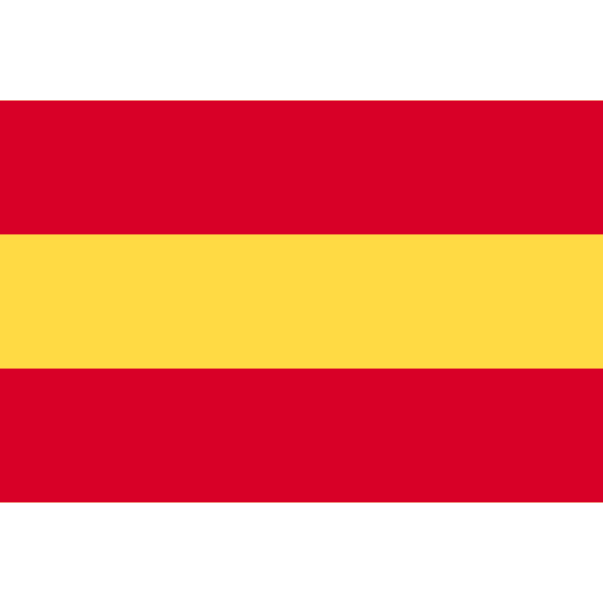
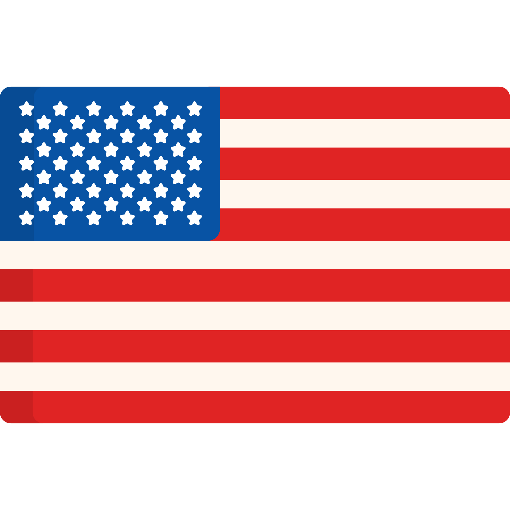

# 
Learning Path

**We are delighted that you are interested in creating your social currency using Cambiatus.**

Our coin co-design process starts with a mindset change. To be able to design complementary currencies, we need to re-signify what money is, what success is, and imagine new organizations.

That's why we've separated some important materials so you can your own path and **learn at your own pace** about some innovative and transformative topics. This document contains content in Portuguese , Spanish , and also English , always flagged, which are some of the languages we use.

First, we would like to introduce you to **Cambiatus**:
>We are an open source platform that helps in the creation of new organizations, through social currencies on Blockchain.

[Here](https://www.youtube.com/watch?v=R5SGTaFCsgU "This is Cambiatus")  we talk about the work we do and how we impact the lives of people and communities around the world.

## Blockchain
We want to present a technology with transformative potential. The main difference between social currencies created using Cambiatus and the others mentioned is that we use blockchain technology. And you must be wondering: [what is blockchain and what is it for?](https://blog.pabloreyes.es/que-diablos-es-blockchain/ "¿Qué diablos es Blockchain?") 

>In a simple way, we can say that Blockchain is a public database in which digital events are recorded and distributed among many people. This base can be updated when there is consensus among the participants, and from there the new information will be safely saved and cannot be deleted later.

In short: blockchain **serves to transfer value between people without the need for intermediaries**. This means that the currencies that use Cambiatus do not need financial or governmental institutions to exchange value with each other.

[In this video](https://www.youtube.com/watch?v=hYip_Vuv8J0&t "Blockchain Expert Explains One Concept in 5 Levels of Difficulty") , Bettina Warburg explains what technology is for different age groups. [This article](https://tecnoblog.net/responde/como-funciona-blockchain-bitcoin/ "What is blockchain? [going beyond bitcoin]")  also explains what blockchain is, and a little bit of its history.

So we think you might be asking yourself another question: but what about bitcoin? Where does he fit into all this? Bitcoin was the first application of blockchain technology, and after it came several other networks, mainly focused on smart contracts, or smart contracts, with different characteristics and functionalities, such as Ethereum, CELO, Harmony, Algorand or EOS, used in Cambiatus. [In this video](https://www.youtube.com/watch?v=goC8QYVqdCA "Live Streaming from Spirit HUB") , Luiz Hadad makes a brief introduction to what blockchain is and its possible applications (the speech starts at minute 55) and will explain better about this blockchain.

But then, why use this technology in the implementation of social currencies? Blockchain offers decentralization, transparency and security in data transmission. These features can be exploited for many applications in currency exchanges, product traceability, smart contracts and even voting systems. [This video](https://www.youtube.com/watch?v=7DzdQPsjzis&t= "Applications of the blockchain: what is to come")  talks about some applications of the technology. [Already here](https://www.youtube.com/watch?v=Pl8OlkkwRpc "How the blockchain is changing money and business")  addresses the change that blockchain is bringing about in the financial and business world.

Here [in this article](https://medium.com/el-blog-de-sustainability-school/blockchain-y-las-tendencias-culturales-de-m%C3%A1s-impacto-5f18ae707f4e "Blockchain y las Tendencias Culturales with bad impact") , Karla Córdoba highlights the selection of technology as one of the Cultural Trends by the Sparks & Honey agency. But, beyond the financial universe, there are [many applications](https://www.apd.es/aplicaciones-blockchain/ "7 applications of blockchain technology")  for blockchain technology.

## DAOs and new organizations
One such application is DAOs, (acronym for Decentralized Autonomous Organizations).
>DAOs are communities that operate and make decisions based on rules encoded in computer programs called smart contracts.

At Binance Academy, we have a [interesting guide on DAOs](https://academy.binance.com/en/articles/decentralized-autonomous-organizations-daos-explained "Guide on Decentralized Autonomous Organizations (DAOs)") . [Here](https://www.youtube.com/watch?v=Pyi8-qm02hs "Decentralized Autonomous Organization") , we have a video explanation, already [in this article](https://newsletter.banklesshq.com/p/how-crypto-is-regenerating-the-world?s=r "How Crypto is Regenerating the World") < img src="assets/en.png" alt="English" height="15"/> Kevin Owocki talks about the concept of impact DAOs, and shows examples that are helping this movement.

Therefore, [here](https://www.youtube.com/watch?v=RiheJnqoKcY "Las organizaciones del futuro, today") , Karla Córdoba talks about the way we shape our organizations and possibilities for the organizations of the future. The transparency and decentralization of blockchain helps to eliminate corruption and third-party intermediation in transactions, which allows organizations and communities to operate without the need for a central authority. DAOs allow a network of people or entities to define their own rules of collaboration to achieve their common goals.

As an organization, we at Cambiatus are also part of the [Exit to Community](https://www.colorado.edu/lab/medlab/2020/08/31/exit-community-community-primer "Exit to Community") , a global movement that seeks to create an alternative to the traditional *"exit"* world of *startups*. [In this video](https://www.youtube.com/watch?v=IdwzoJhD9aQ "Exit to Community: A new option for the startups we love")  Lauren Ruffin explains the thinking surrounding the maturation of organizations and community-oriented entrepreneurship.
 
All this work is the result of the emergence of new types of organization. [In this video](https://www.youtube.com/watch?v=QwwtFr607jw&t "Monedas sociales y blockchain")  , Karla Córdoba, Cambiatus initiator, talks about Social Currencies and Blockchain. These organizations are tools that we can use to build desirable futures. [In this video](https://www.youtube.com/watch?v=SD1c1ms8Pl0&t "Tools to build desirable futures")  Luiz Hadad, leader of community building at Cambiatus, talks about how blockchain and ESG can be tools in this direction. ESG, an acronym for environmental, social and governance, corresponds to a spectrum that guides the actions of organizations committed to the sustainability of the planet. This does not mean that we should stick to sustainability. We must go further and seek regeneration.

## Desirable futures and regenerative finance

Lala Deheinzelin, [in this TED](https://www.youtube.com/watch?v=HoAi9jjm43w "Creating Creative and Collaborative Communities") , teaches us to build creative and collaborative communities to build desirable futures.

ESG practices, and also with the [Sustainable Development Goals](https://brasil.un.org/pt-br/sdgs "Sustainable Development Goals | The United Nations in Brazil") , are commitments that we establish based on the understanding that the world is already changing.

When we talk about governance for sustainability we also need to talk about regenerative finance.
>Regenerative finance, commonly simplified as ReFi, is a set of actions that aim to contribute to the regeneration of natural resources and the resolution of systemic social problems through a more conscious use of economic and financial tools.

[In this article](https://medium.com/regenliving/what-is-regenerative-financing-refi-8bebaf2e0a4d "What is Regenerative Finance (ReFi)?")  Letty Prados addresses the concept of regenerative economy and positions regenerative finance within the web3 ecosystem. 
Marcelo Silva [presents some success stories](https://prensa.li/@marcelo.silva/o-que-sao-financas-regenerativas-refi-parte-i/#:~:text=Simples%20e%20direto%3A%20s%C3%A3o%20iniciativas,regenerar%20ou%20conservar%20a%20natureza)  of ReFi protocols and also [addresses the importance of the topic for the Brazilian context](https://prensa.li/@marcelo.silva/o-que-sao-financas-regenerativas-refi-parte-ii/)  in this two articles.

[In this map](https://kumu.io/climate-collective/web3-climate-map#main), organized by Climate Collective represents the well-known entities building ReFi applications in the web3 ecosystem. It helps us to understand the complexity and plurality of actions that can be performed in this field, so we can turn to projects that seek to solve real problems in favor of more regenerative societies.

Already [In this video](https://www.youtube.com/watch?v=xguam0TKMw8 "Principles for Dealing with the Changing World Order") , Ray Dalio tells us about some cycles that history shows us, about glocal changes. And will the future tend to repeat itself? Or can we reinvent the way we organize ourselves, and change our financial, social and economic paradigm?

## Economy, money and social currencies

For these changes to be possible, it is necessary to rethink much of the culture in our society. [Here](https://www.youtube.com/watch?v=-GoFzU3cRE4 "Sacred Economics") , Charles Eisenstein reflects on the history of money from the earliest economies. Already [in this video](https://www.youtube.com/watch?v=M4ThwS1Xln0 "Why money needs to change now")  Bernard Lietaer, an important theorist on social currencies, also talks about the urgency of changing money as we know it, advocating for a financial ecosystem that seeks and privileges economic resilience, in the face of efficiency - this is the real root of our problems .
>The current financial system maintains the monopoly of money creation in the hands of a few institutions, and the design of the money created, through debt, has the effect of maintaining the *status quo*: concentration of wealth, extractive pressure on resources land and cyclical economic crises.

If you've ever asked yourself “what is money? How is it created?”, “How is it controlled?”, you have probably also asked “what if we had the power to create our own money?”. Here, we present you some books like [“Nuevo dinero para la sostenibilidad”](https://payhip.com/b/dtFf "Nuevo dinero para la sostenibilidad") , [“How to create our money and build sustainability”](https://payhip.com/b/stIi "How to create our money and build sustainability") , and [“This is the Mutual Credit Clearing System”](https://payhip.com/b/qGOz "This is the Mutual Credit Clearing System" )  where you can dig deeper.

And it is for questions like these that we are dealing with the concept of social currencies. [In this article](https://medium.com/el-blog-de-sustainability-school/dinero-y-sostenibilidad-c6d1a2b7d9a8 "Dinero y Sustenibilidad: ¿por que es una relación tanpoco comprendida?") , Ranulfo Paiva explains the relationship between money and sustainability. Already [here](https://www.elmagacin.com/las-10-monedas-sociales-mas-interesantes-del-mundo/ "Las 10 social monedas mas interesantes del mundo") , you can read about some of the most interesting social currencies in the world.

[Here](https://www.youtube.com/watch?v=g_M-aJgCKYc "Monedas Sociales") , we have an interesting documentary about social currencies. There are examples of community banks that use social currencies that are not necessarily digital, such as [Rede Alegrias](https://www.youtube.com/watch?v=khS2JE1rEIM "Rede Alegrias") , or [Palmas](https://www.youtube.com/watch?v=vxuMhwuRaFU "Palmas") , in Ceará, and [Mumbuca](https://www.youtube.com/watch?v=q8S2enuj9-M "Conheça a Moeda Mumbuca") , in Rio de Janeiro.

## Our communities

The complementary currencies that use Cambiatus converge on this mindset shift and are used by organized groups of people to promote their common actions and goals. Another convergence involves social and environmental concerns. [In this article](https://medium.com/cambiatus/cambiatus-na-constru%C3%A7%C3%A3o-da-rede-de-parceiros-6a755e27dd8d "Cambiatus and its members: co creating social currencies and businesses collaborative") Juliana Ramos talks about the process of co-creation of our coins.

* ### [Natus System](https://www.cambiatus.com/pt-br/pilots-natus "Natus System")
The Natus System of Environmental Cryptoassets is an innovative initiative that brings together entrepreneurs, owners of Private Environmental Reserves (PPA) and users with the best of blockchain technology to strengthen the global network of PPAs.

It works by joining a reservation, where a technical team analyzes the generated environmental benefits. This is how Natus-Units are born, digital certificates that represent the benefits generated in a period of one year. [In this video](https://www.youtube.com/watch?v=X-wrnWL1NF0&t "Natus Environmental Crypto Assets System: How it works and how to participate")  we have a conversation about how to join the system and how it works.

* ### [Verdes](https://www.cambiatus.com/pt-br/pilots-verdes "Verdes")
Verdes, a social currency that promotes conscious green actions and rewards volunteerism, while reactivating the local economy despite the negative effects of the Covid-19 pandemic on tourism, the main source of economic activity in the region. Located in Monteverde, Costa Rica, where it promotes a circular economy and a network of exchanges.

[Here](https://www.youtube.com/watch?v=qRphrJpdrwE "Los Verdes: La nueva local moneda de Monteverde")  we have an introduction about this coin and its use. Already [in this video](https://www.youtube.com/watch?v=HXt2fuDgYfc "OPEN Session: Verdes (Costa Rica)")  we have an open session promoted by Cambiatus that goes a little deeper into our community. Also, [here in this article](https://medium.com/cambiatus/verdes-a-moeda-social-que-alia-sustentabilidade-e-resili%C3%AAncia-econ%C3%B4mica-72c989f9da92 "Greens: the social currency that combines sustainability and economic resilience")  Críscia Cesconetto talks about sustainability and economic resilience promoted by the currency.

* ### [Muda](https://www.youtube.com/watch?v=1NtGs7QjtJw "Muda")
Muda is a virtual community started by a group of artists, teachers, cultural makers, social entrepreneurs, surfers, hackers, producers and dreamers. Structured as a promotion network, it seeks to encourage cultural, educational and socio-environmental actions that are often not covered by the traditional financial system.

With the arrival of the pandemic, the initiators of Muda prepared a project to support the community of artists who had their income affected by social isolation. In order to subvert exclusionary ways of thinking about the economy, a complementary social currency was created, MUDA, hosted by Cambiatus. Starting its operation in December 2019, the platform already has more than 4,000 members and 800 offers on its P2P store. [In this open session](https://www.youtube.com/watch?v=1NtGs7QjtJw)  we present the largest community in Cambiatus operation.

* ### [Play4Change](https://www.cambiatus.com/pt-br/pilots-play4change "Play4change")
The [latest community](https://www.youtube.com/watch?v=ZF5rNJepU44)  using Cambiatus, the Play4Change believes that blockchain can empower the unbanked population to move beyond the very expensive and archaic banking system and gain access to previously inaccessible financial services.

It was born with the purpose of generating financial inclusion, educational empowerment and social transformation leveraging Play 2 Earn blockchain games, and currently, in addition to supporting players, it holds educational sessions weekly, covering hard skills such as blockchain, crypto, financial literacy, how to use digital wallets, as well as soft skills such as leadership, communication and creativity. [In this article](https://medium.com/cambiatus/play4-change-se-junta-ao-ecossitema-da-cambiatu-625fe791036b)  we announce your membership of our platform.

* ### [Agelgil](https://www.cambiatus.com/pt-br/pilots-agelgil "Agelgil")
Formed and led by women, Agelgil, located in Adama, Ethiopia, is a community formed by self-help groups. In Adama, self-help groups (SHG) typically gather 15 to 20 people every week to support each other financially and encourage one another. They start by saving small amounts on a regular basis, and then they start taking out small group loans at a low interest rate. Members often use the money to start or expand their own businesses. They also receive training for small businesses, where many of these groups are made up entirely of women.

An agelgil is a traditional Ethiopian container for keeping food fresh and transporting it while working in the field. You carry food with you and are also able to share it with others. This is the symbol our community pilot in Ethiopia chose for their complementary currency, the AGL. [Here in this open session](https://www.youtube.com/watch?v=DZNNXfWsIrs "Open Session: Agelgil (Ethiopia)")  we can get to know the community more deeply, and [in this article](https://medium.com/cambiatus/agelgil-mulheres-e-resili%C3%AAncia-financeira-na-%C3%A1frica-55e27b8cd683 "Agelgil: women and financial resilience in Africa") , Críscia Cesconetto talks about financial resilience and the co-design process and the Agelgil's accession to Cambiatus.

We are very happy with this trail! Now, we also recommend this supplementary content: 
* [Complementary Currencies in Blockchain as an Incentive Mechanism: Why Support Them?](referenciascientificas.md "Complementary Currencies in Blockchain as an Incentive Mechanism: Why Support Them?")
* [How to start your study group in 4 steps](grupodeestudos.md "How to start your study group in 4 steps")

We continue to address these and other issues on our networks: 
[Medium](https://medium.com/cambiatus "Medium") | [Youtube](https://www.youtube.com/channel/UCIyb1r-Mj12veCMIB-EEzaA/featured "Youtube") | [Twitter](https://twitter.com/_cambiatus "Twitter") | [Linkedin](https://www.linkedin.com/company/cambiatus/about/ "Linkedin") | [Instagram](https://www.instagram.com/cambiatus/ "Instagram") | [Facebook](https://www.facebook.com/Cambiatus "Facebook")

